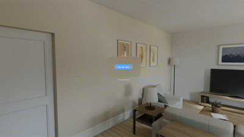

# VisionOS-Lab
Hands-on visionOS experiments showcasing immersive video, 3D rendering, spatial input, and spatial UI design patterns.

## [Google Map Street View](google_street_view/google_street_view)
Explore and navigate street views in a fully immersive experience inside the Vision Pro app.

|  |  |
|:--|:--|

Replace the Google cloud api key (with map/geocoding access permission) in the [config file](google_street_view/google_street_view/Config.sample.plist) to play the app

## [Immersive 360 Degree Video Player](immersive_video_player/immersive_video_player)
A demo app that plays immersive 360-degree videos in Vision Pro.

🎥 Demo

